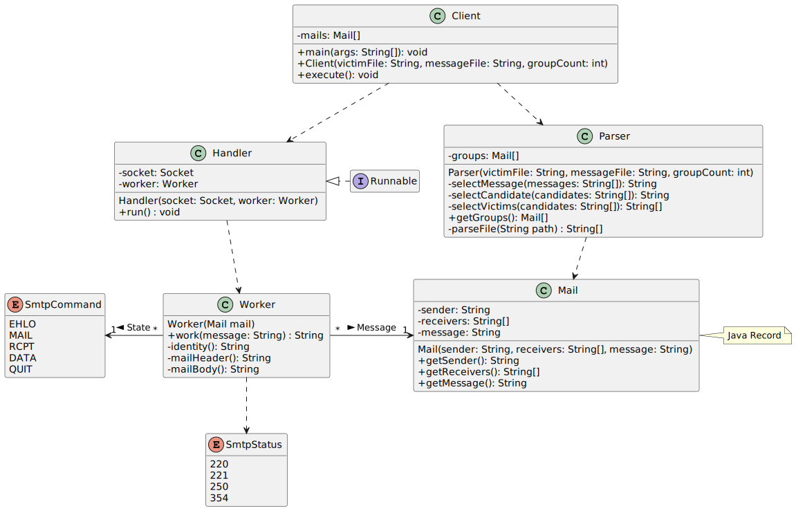

# DAI Lab 3: SMTP

---

## Description

This client allow you to play e-mail pranks on a list of victims. You need to provide a list of victims (a list of e-mail) and a list of messages, both in *.txt format encoded on UTF-8. You need to specify the number of group on which the prank is played. The sender of the mail will be chose randomly from the victims list. Receivers' group of the mail will be randomly selected from the victim list as well. The content of the mail will be randomly selected from the list of message. By default, the prank is played on a mock server run on docker, you can change that by editing a file.
This client allow you to play e-mail pranks on a list of victims. You need to provide a list of victims (a list of e-mail) and a list of messages, both in*.txt format encoded on UTF-8. You need to specify the number of group on which the prank is played. The sender of the mail will be chose randomly from the victims list. Receivers' group of the mail will be randomly selected from the victim list as well. The content of the mail will be randomly selected from the list of message. By default, the prank is played on a mock server run on docker, you can change that by editing a file.

## Setup

If you want to use a mock SMTP server,set up the [MailDev](https://github.com/maildev/maildev) fake SMTP server:
If you want to use a mock SMTP server,set up the [MailDev](https://github.com/maildev/maildev) fake SMTP server:

```bash
docker compose up
```

The default value play the prank on this mock server, otherwise see at [Settings](##Settings) how to change the server on which the prank is played.

The default value play the prank on this mock server, otherwise see at [Settings](##Settings) how to change the server on which the prank is played.

Then build the project using the following command:

```bash
mvn -f smtpclient/pom.xml clean:package
```

Finally, you can run the project by executing the JAR package:

```bash
java -jar smtpclient/target/smtpclient-1.0-SNAPSHOT <pathToTheVictimsList> <pathToTheMessageList> <numberOfGroupToPrank>
java -jar smtpclient/target/smtpclient-1.0-SNAPSHOT <pathToTheVictimsList> <pathToTheMessageList> <numberOfGroupToPrank>
```

## Settings

You can modify the members SERVER_SOCKET and SERVER_ADDRESS at [SmtpClient.java](smtpclient/src/main/java/ch/heig/dai/lab/smtp/SmtpClient.java ) to adjust the server you want to play the prank.

```java
...
/**
* The port of the server.
*/
final static int SERVER_SOCKET = 1025;

/**
* The address of the server.
*/
final static String SERVER_ADDRESS = "localhost";
...
```

## Implementation

There is four classes and two enum and one record.

Client:

- SmtpClient: Check if the arguments are valid and launch SmtpHandler, use GroupParser to get a list of Record Mail on which the prank will be player
- GroupParser: Parse the victims and messages files, generate randomly Mail record with the parsed content.
- SmtpHandler: Does the process answer-response with the mail server, use MailWorker to answer to the server.
- MailWorker: Know which answers to give to the SMTP server at what step.

Record: Mail: Used to store the sender, receivers and content of the mail.

Enum:

- SmtpStatus : each status message from the server,
- SmtpCommand: SMTP command to use to answer to the server

### UML diagram



## Example

```
user@pc:~$ java -jar smtpclient-1.0-SNAPSHOT.jar victims.txt messages.txt 3
                      dP                     dP oo                     dP   
                      88                     88                        88   
.d8888b. 88d8b.d8b. d8888P 88d888b. .d8888b. 88 dP .d8888b. 88d888b. d8888P 
Y8ooooo. 88'`88'`88   88   88'  `88 88'  `"" 88 88 88ooood8 88'  `88   88   
      88 88  88  88   88   88.  .88 88.  ... 88 88 88.  ... 88    88   88   
`88888P' dP  dP  dP   dP   88Y888P' `88888P' dP dP `88888P' dP    dP   dP   
                           88                                               
                           dP                         by Balkghar & a-mango 

> Victim file: victims.txt
> Message file: messages.txt
> Group count: 3
> Server: localhost:1025
> Do you want to continue? [y/N] y
> Starting virtual threads...
> Sending mail from proin.mi@icloud.edu to 4 recipients...
> Sending mail from magna.ut.tincidunt@icloud.com to 2 recipients...
> Sending mail from fermentum.metus.aenean@google.org to 3 recipients...
> All mails sent.
```
