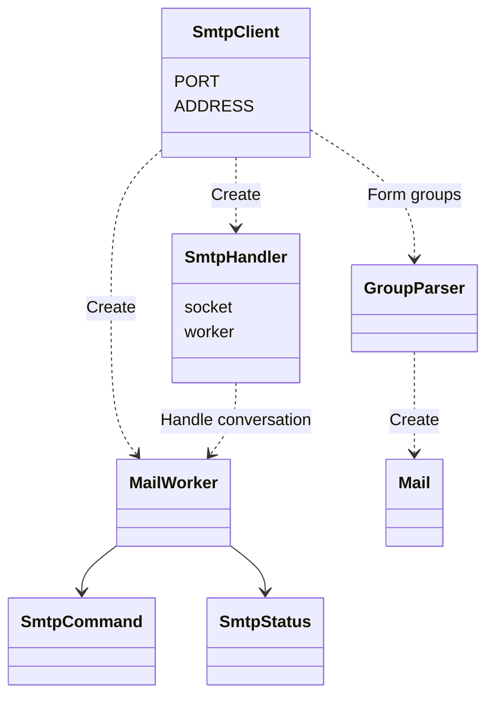
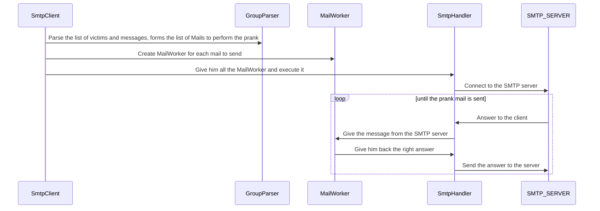
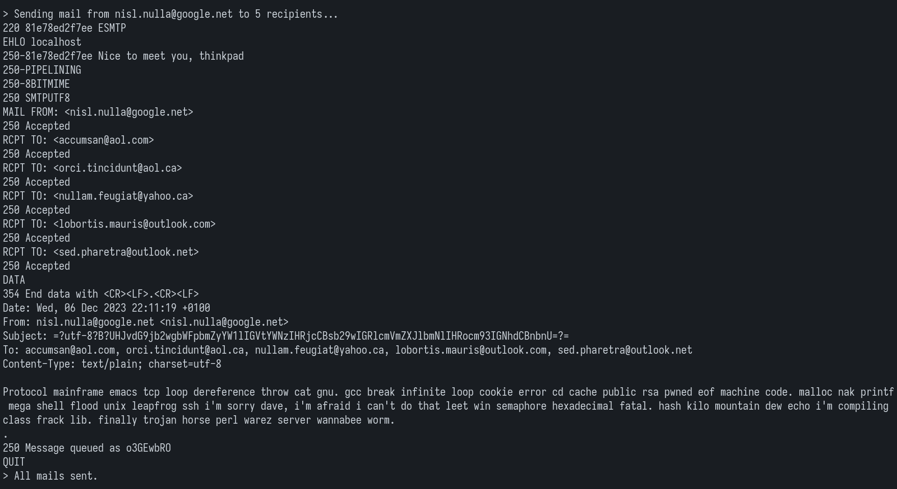
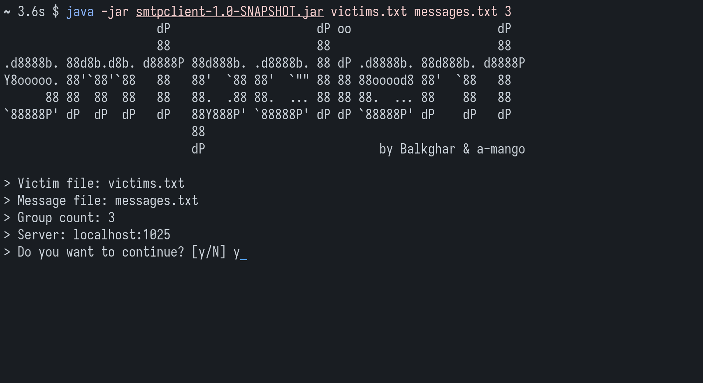
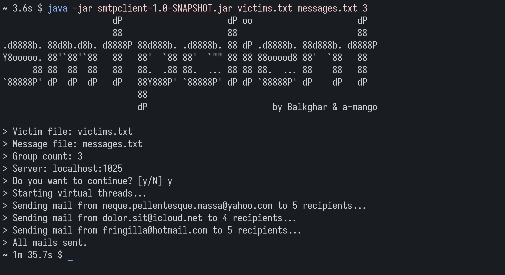

# DAI Lab 4: SMTP

## Description

This client allow you to play e-mail pranks by randomly selecting messages and victim addresses from specified files.

Usage :

```bash
java -jar smtpclient-*.jar <victimFile> <messageFile> <groupCount> [uri]
```

The victim file must contain valid email addresses. The message file can contain any valid UTF-8 character. Some fake emails and messages used for demonstration purposes are inculded with the program. For more customization options, see [Settings](#settings)

## Setup

The prerequisites for building this project are [Maven](https://maven.apache.org/install.html) and [Docker](https://docs.docker.com/get-docker/).

You may want to use a mock SMTP server to use this program. You can set up the [MailDev](https://github.com/maildev/maildev) fake SMTP server by running the [docker-compose](./docker-compose.yml) configuration found in this repo:

```bash
docker compose up
```

You can build the project using the following command:

```bash
mvn -f smtpclient/pom.xml clean package
```

Finally, you can run the project by executing the JAR package (the prank will be played on the mock SMTP Server by default):

```bash
java -jar smtpclient/target/smtpclient-1.0-SNAPSHOT.jar <pathToVictimsList> <pathToMessagesList> <numberOfGroupsToPrank>
```

## Settings

You can modify the address and port of the SMTP server with command line arguments or by modifying the default values in the source code.

The program uses the target and message lists found in the [resources](smtpclient/src/main/resources) folder. If you want to customize them or even add your own, you can do that there. Don't forget to repackage the program with Maven afterwards.

## Implementation

The program uses one record, four classes and two enums.

Record:

- `Mail`: A simple data encapsulation entity to store the sender, receivers and content of an email.

Classes:

- `SmtpClient`: This is the main program. It checks if the arguments are valid and uses the GroupParser to get a list `Mail` records. One `SmtpHandler` per mail is then ran using Java virtual threads.
- `GroupParser`: Parses the victims and messages files, does some validation and generates random group.
- `SmtpHandler`: Handles the process of talking and listening to the SMTP server. It uses a `MailWorker` to do the actual command parsing work.
- `MailWorker`: Responsible for the parsing and treatment of the server messages and the generation of the next command to be sent. Upon error, it always sends a `QUIT` message to try to exit gracefully.

Enums:

- `SmtpStatus` : Status messages of the server. Handles a few specific SMTP statuses but could be extended to match the RFC requirements.
- `SmtpCommand`: SMTP conversation steps and associated commands to be sent to the server.

NB: the choice was made to use enums because they allow us to iterate in order on a number of steps easily.

### Class diagram



You can find a more detailed class diagram of the program [here](./figures/class_diagram.png)

### Sequence diagram



### SMTP Conversation



## Showcase




